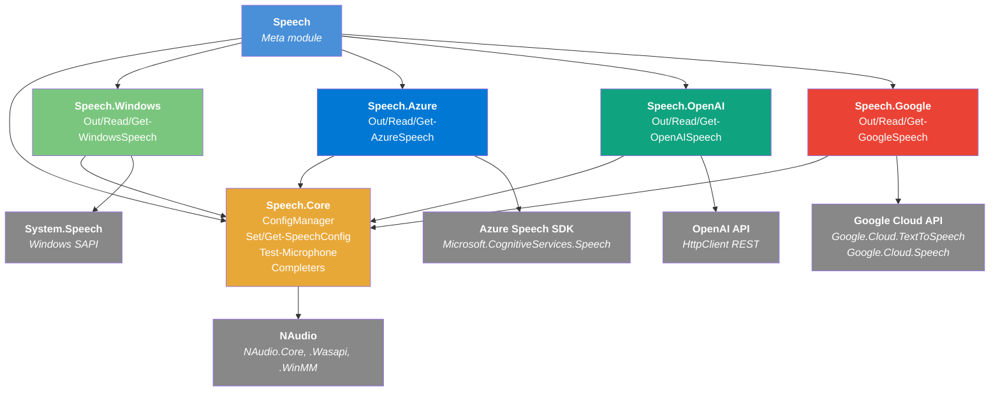

# Speech Module Dependencies

```mermaid
graph TD
    Speech["<b>Speech</b><br/><i>Meta module</i>"]
    Core["<b>Speech.Core</b><br/>ConfigManager<br/>Set/Get-SpeechConfig<br/>Test-Microphone<br/>Completers"]
    Windows["<b>Speech.Windows</b><br/>Out/Read/Get-WindowsSpeech"]
    Azure["<b>Speech.Azure</b><br/>Out/Read/Get-AzureSpeech"]
    OpenAI["<b>Speech.OpenAI</b><br/>Out/Read/Get-OpenAISpeech"]
    Google["<b>Speech.Google</b><br/>Out/Read/Get-GoogleSpeech"]
    NAudio["<b>NAudio</b><br/><i>NAudio.Core, .Wasapi, .WinMM</i>"]
    AzureSDK["<b>Azure Speech SDK</b><br/><i>Microsoft.CognitiveServices.Speech</i>"]
    SAPI["<b>System.Speech</b><br/><i>Windows SAPI</i>"]
    GoogleAPI["<b>Google Cloud API</b><br/><i>Google.Cloud.TextToSpeech<br/>Google.Cloud.Speech</i>"]
    OpenAIAPI["<b>OpenAI API</b><br/><i>HttpClient REST</i>"]

    Speech --> Core
    Speech --> Windows
    Speech --> Azure
    Speech --> OpenAI
    Speech --> Google

    Windows --> Core
    Azure --> Core
    OpenAI --> Core
    Google --> Core

    Core --> NAudio
    Windows --> SAPI
    Azure --> AzureSDK
    Google --> GoogleAPI
    OpenAI --> OpenAIAPI

    style Speech fill:#4a90d9,color:#fff
    style Core fill:#e8a838,color:#fff
    style Windows fill:#7bc67e,color:#fff
    style Azure fill:#0078d4,color:#fff
    style OpenAI fill:#10a37f,color:#fff
    style Google fill:#ea4335,color:#fff
    style NAudio fill:#888,color:#fff
    style AzureSDK fill:#888,color:#fff
    style SAPI fill:#888,color:#fff
    style GoogleAPI fill:#888,color:#fff
    style OpenAIAPI fill:#888,color:#fff
```
